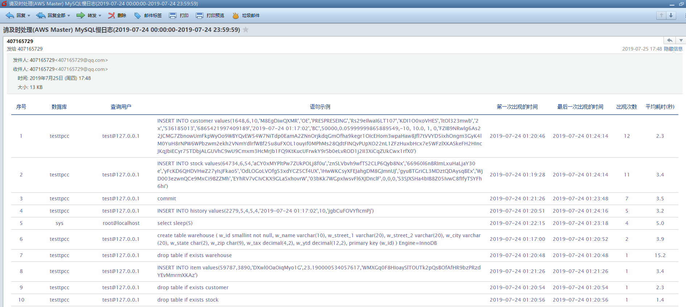

## MySQL慢查询邮件报表
一个基于Golang html/template开发的发送慢查询邮件报表的程序

## 特性
- 采用高性能[easyjson](https://github.com/mailru/easyjson)解析pt-query-digest分析出来的JSON格式的慢查询
- 漂亮的邮件模板
- 可限制发送的慢查询条数(免得太多，给开发留点面子^_^)
- 对MySQL零侵入
- 当天运行程序默认分析昨天产生的慢查询

## 使用
### 安装pt-query-digest工具
[安装参考](https://aikbuk.com/2018/07/06/mysql-slowlog/)
```bash
# 安装依赖
yum install perl-DBI perl-DBD-MySQL perl-Time-HiRes perl-IO-Socket-SSL perl-Digest-MD5 perl-TermReadKey -y
# centos 7
wget https://www.percona.com/downloads/percona-toolkit/3.0.13/binary/redhat/7/x86_64/percona-toolkit-3.0.13-1.el7.x86_64.rpm
rpm -ivh percona-toolkit-3.0.13-1.el7.x86_64.rpm
# centos 6
wget https://www.percona.com/downloads/percona-toolkit/3.0.13/binary/redhat/6/x86_64/percona-toolkit-3.0.13-1.el6.x86_64.rpm
rpm -ivh percona-toolkit-3.0.13-1.el6.x86_64.rpm
```
### 修改pt-query-digest源码防止其解析后的json文件里中文乱码
```bash
# 直接修改原文件
vim /usr/bin/pt-query-digest +9
第9行新增use Encode;
第8188行注释return $json;
第8189行新增return Encode::decode_utf8($json);
# 如果不想打开编辑，可以直接采用sed更改
sed '9c use Encode;' -i /usr/bin/pt-query-digest
sed '8188c\   #return $json;' -i /usr/bin/pt-query-digest
sed '8188a\   return Encode::decode_utf8($json);' -i /usr/bin/pt-query-digest
```
### 编译
需要有go环境，[go安装参考](https://aikbuk.com/2018/10/31/go%E5%AE%89%E8%A3%85/)
```bash
git clone https://github.com/wangtuo1224/mysql_slowlog_report.git
cd mysql_slowlog_report
# 编译可执行文件到当前目录
go build
# 将可执行文件安装到GOPATH
go install
```
### 运行
示例
```bash
./mysql_slowlog_report --help
usage: mysql_slowlog_report [<flags>]

Flags:
  -h, --help                  Show context-sensitive help (also try --help-long and --help-man).
      --limit=10              Limit the number of display records. // 控制显示慢查询的条数
      --ptbin.path="/usr/bin/pt-query-digest"  
                              Where is pt-query-digest. // 指定pt-query-digest的安装位置
      --slowlog.path="/tmp/slowquery.log"  
                              Where is mysql slowlog. // 指定慢查询日志路径
      --tag="AWS Master"      Business tag. // 业务标签，显示在邮件主题
      --email.revicers=""  
                              Send email to users. // 邮件接收人，多个以英文逗号分隔
      --email.serverHost=""  
                              Email server host. // 发件服务器主机
      --email.serverPort=0  Email server port. // 发件服务器端口
      --email.from=""  
                              Email from user. // 邮件发送者账号
      --email.password=""     Email from user's password. // 邮件发送者密码或授权码
      --exclude.users=""     Exclude mysql users comma separated. // 过滤指定用户的慢查询，多个以逗号分隔
      --analyze.day=-1       -1 means yestarday, -2 means the day before yestarday. // -1表示昨天00:00:00到昨天23:59:59，-2表示前天00:00:00到昨天的23:59:59

      --version               Show application version. // 显示版本
      
./mysql_slowlog_report --limit=10 --ptbin.path=/usr/bin/pt-query-digest --slowlog.path=/tmp/slowquery.log --tag="AWS Master" --email.recivers=407165729@qq.com --email.serverHost="smtp.qq.com" --email.serverPort=587 --email.from=407165729@qq.com --email.password="yourpassword"
```



tips:
- 如果不想把邮件账号密码相关信息暴露出来，可以修改util文件夹下的send_mail.go，找到return &EmailParam相关代码位置，将参数写死，这样暴露给调用者的就没有敏感信息
